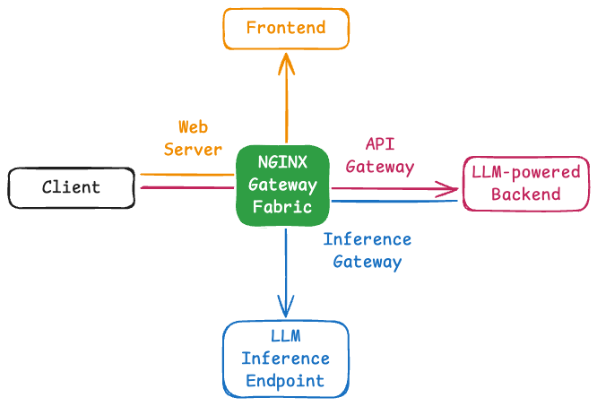

# NGF Agentic Reference Stack

A reference implementation showcasing NGINX Gateway Fabric as a multi-layer gateway for AI agent applications.



## Architecture

This project demonstrates NGF serving three critical gateway roles:

1. **Reverse Proxy/Web Server** - Routes traffic to the AI chatbot frontend
2. **API Gateway** - Manages frontend-to-backend chat completion requests
3. **LLM Inference Gateway** - Routes backend requests to vLLM inference API via Gateway API inference extension

### Components

- **Frontend**: Browser-based AI chatbot UI. Served by NGF acting as a reverse proxy, and configured to send chat completion requests to the backend API. Uses the [leonseng/openai-proxy-with-f5-guardrails-frontend](https://hub.docker.com/r/leonseng/openai-proxy-with-f5-guardrails-frontend) image.
- **Backend**: OpenAI-compatible API proxy. Accepts chat completion requests from the frontend and forwards them to the inference gateway. NGF acts as an API gateway in front of this service. Uses the [leonseng/openai-proxy-with-f5-guardrails](https://hub.docker.com/r/leonseng/openai-proxy-with-f5-guardrails) image.
- **Inference Simulator**: Simulates a [vLLM](https://github.com/vllm-project/vllm) server. Deployed as 2 replicas grouped into a Gateway API `InferencePool` for pool-based load balancing.
- **Endpoint Picker Pod / EPP**: A gRPC extension deployed alongside the inference simulator. NGF calls the EPP per-request to resolve the best replica based on inference-specific signals such as KV-cache locality, replacing simple round-robin.
- **Gateway**: ([NGINX Gateway Fabric](https://github.com/nginx/nginx-gateway-fabric)) as the single data-plane entry point for all three layers.

## Getting Started

**Prerequisites:** [k3d](https://k3d.io/stable/#installation) and `kubectl`

1. Create the k3d cluster
    ```bash
    ./scripts/k3d-create-cluster.sh
    ```
2. Deploy the stack (frontend → backend → inference). See [deployment guide](./docs/deployment.md) for the full step-by-step deployment walkthrough.
