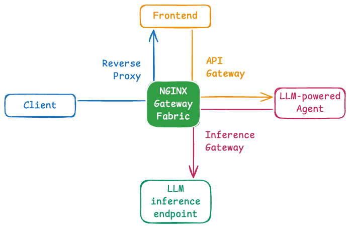

# NGF Agentic Reference Stack

A reference implementation showcasing NGINX Gateway Fabric as a multi-layer gateway for AI agent applications.

## Architecture

This project demonstrates NGF serving three critical gateway roles:



1. **Reverse Proxy** - Routes traffic to the AI chatbot frontend
2. **API Gateway** - Manages frontend-to-backend chat completion requests
3. **LLM Inference Gateway** - Routes backend requests to vLLM inference API via Gateway API inference extension

### Components

- **Frontend**: AI chatbot interface
- **Backend**: Chat completion API service
- **Inference**: vLLM model serving
- **Gateway**: NGINX Gateway Fabric (all layers)

## Getting Started

**Prerequisites:** [k3d](https://k3d.io/stable/#installation) and `kubectl`

```bash
# 1. Create the k3d cluster
./scripts/k3d-create-cluster.sh

# 2. Install NGINX Gateway Fabric with the Gateway API Inference Extension
./scripts/ngf-setup.sh

# 3. Deploy the stack (frontend → backend → inference)
```

See [deployment.md](./docs/deployment.md) for the full step-by-step deployment walkthrough.
