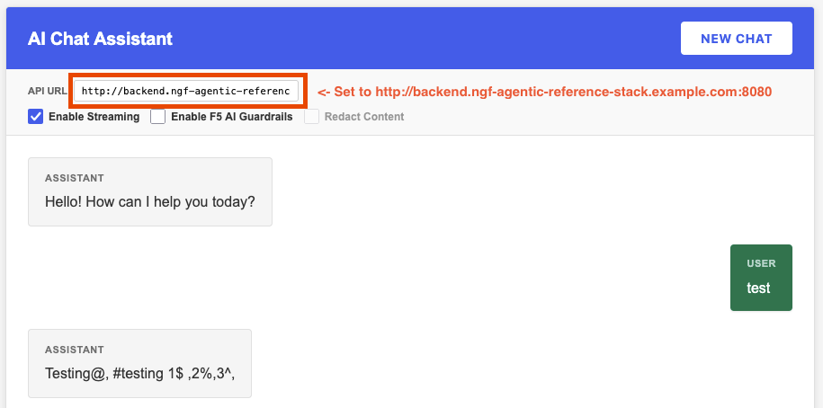
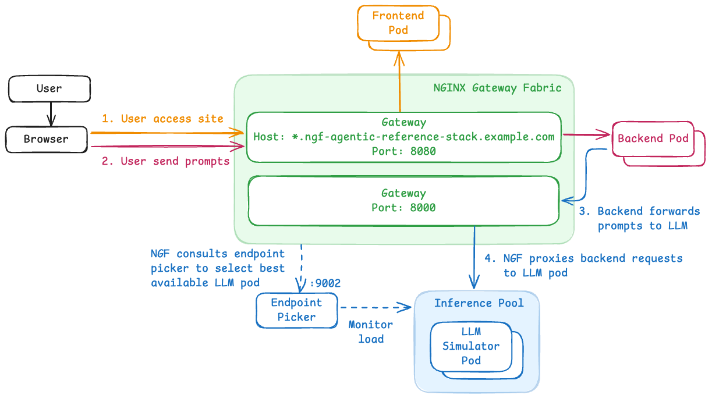

# Deployment Guide: NGF as a Multi-Layer Proxy for an LLM App

This guide walks you through deploying an LLM-powered chatbot on Kubernetes, using NGINX Gateway Fabric (NGF) as the central proxy at every layer. You will build the stack incrementally - each step adds a new application component and the corresponding NGF routing configuration - so you can observe NGF's capabilities grow from a simple reverse proxy to a full inference gateway.

**Prerequisites:**

- A Kubernetes cluster with NGINX Gateway Fabric installed with inference extension support
- To reach the app via its hostnames, add entries to `/etc/hosts` (or use `curl --resolve`):
  ```
  <cluster-ip>  frontend.ngf-agentic-reference-stack.example.com
  <cluster-ip>  backend.ngf-agentic-reference-stack.example.com
  ```
  Replace `<cluster-ip>` with the address of your load balancer or node (e.g. `my-k3d-host.example.com` if using the reference k3d setup).

---

## Step 1 - Create the Gateway

The `Gateway` resource is the central NGF object. It declares two listeners:
- `client-side` on port **8080** - for browser and API traffic from the `frontend` and `backend` namespaces
- `inference-pool` on port **8000** - for LLM inference traffic from the `vllm` namespace

Deploy it first. Routes will be attached in later steps as each component is added.

```bash
kubectl -n nginx-gateway apply -f inference-gateway/gateway.yaml
```

**Verify:**

```bash
kubectl -n nginx-gateway get gateway inference-gateway
```

The gateway will show `Programmed: True` once NGF has picked it up. The listeners won't have accepted routes yet - that is expected.

---

## Step 2 - Layer 1: NGF as a Reverse Proxy (Frontend)

Deploy the chatbot frontend and an `HTTPRoute` that tells NGF to forward requests for `frontend.ngf-agentic-reference-stack.example.com` to it.

```bash
kubectl create namespace frontend
kubectl -n frontend apply -f frontend/deployment.yaml
kubectl -n frontend apply -f frontend/service.yaml
kubectl -n frontend apply -f frontend/httproute.yaml
```

**What just happened?**

The `HTTPRoute` binds to the `client-side` listener on the `inference-gateway` Gateway (in the `nginx-gateway` namespace). NGF programs NGINX to proxy all requests with that hostname to the `frontend` service on port 80.

**Verify:**

```bash
kubectl -n frontend get httproute frontend
# HOSTNAMES column should show frontend.ngf-agentic-reference-stack.example.com

curl http://frontend.ngf-agentic-reference-stack.example.com:8080
# Returns the chatbot HTML
```

At this point the UI loads but cannot process chat messages — the backend isn't deployed yet.

## Step 3 - Layer 2: NGF as an API Gateway (Backend)

Deploy the backend API service and a second `HTTPRoute` on the same Gateway listener, this time matching a different hostname.

```bash
kubectl create namespace backend
kubectl -n backend apply -f backend/deployment.yaml
kubectl -n backend apply -f backend/service.yaml
kubectl -n backend apply -f backend/httproute.yaml
```

**What just happened?**

NGF now routes two distinct services from a single Gateway:
- the frontend on one hostname, and
- the OpenAI-compatible backend API on another,

highlighting its role as the single data-plane entry point with host-based routing to multiple upstream services.

The backend is pre-configured to forward chat completion requests to `http://inference-gateway-nginx.nginx-gateway:8000/v1` (the inference listener, added in the next step).

**Verify:**

```bash
kubectl -n backend get httproute backend
# Both routes should now be accepted by the gateway

curl http://backend.ngf-agentic-reference-stack.example.com:8080/v1/models
# Returns model metadata (the backend is reachable but will error until the LLM is deployed)
```

## Step 4 - Layer 3: NGF as an Inference Gateway (LLM)

This step wires up the LLM inference layer. It has three parts.

### 4a - Deploy the Inference Simulator

The inference simulator mimics a vLLM server running `meta-llama/Llama-3.1-8B-Instruct`. Two replicas are deployed to demonstrate pool-based load balancing.

```bash
kubectl create namespace vllm
kubectl -n vllm apply -f inference-simulator/deployment.yaml
kubectl -n vllm apply -f inference-simulator/inferencepool.yaml
```

The `InferencePool` CRD groups the two simulator pods into a named pool (`vllm-llama3-8b-instruct`) and declares which port serves inference requests (8000). It also references the Endpoint Picker Pod (EPP) that will be deployed next.

### 4b - Deploy the Endpoint Picker Pod (EPP)

The EPP is a gRPC extension to NGF that implements model-aware load balancing. Instead of round-robin, it can route requests based on KV-cache locality and other inference-specific signals.

```bash
kubectl -n vllm apply -f inference-simulator/endpoint-picker/
```

This creates the relevant objects for the EPP, exposing a gRPC endpoint on port 9002 which NGF calls to resolve the best backend pod for each inference request.

**Verify:**

```bash
kubectl -n vllm get pods
# vllm-llama3-8b-instruct-* (x2) and vllm-llama3-8b-instruct-epp-* should be Running

kubectl -n vllm get inferencepool
```

### 4c - Attach the Inference HTTPRoute

```bash
kubectl -n vllm apply -f inference-simulator/httproute.yaml
```

This `HTTPRoute` binds to the `inference-pool` listener on port 8000 and sets the `InferencePool` (not a plain `Service`) as its backend. NGF uses the EPP to resolve the actual pod for each request.

**What just happened?**

The full inference path is now active: `NGF:8000 → EPP → vLLM replica`. The backend service already points to this address, so chat completions will now flow end to end.

## Step 5 - End-to-End Verification

Confirm all routes are in place:

```bash
kubectl get httproute -A
# NAME        NAMESPACE  HOSTNAMES                                         AGE
# frontend    frontend   frontend.ngf-agentic-reference-stack.example.com  ...
# backend     backend    backend.ngf-agentic-reference-stack.example.com   ...
# llm-route   vllm       <none>                                            ...

kubectl -n vllm get inferencepool
# NAME                       AGE
# vllm-llama3-8b-instruct    ...
```

Open the chatbot in a browser:

```
http://frontend.ngf-agentic-reference-stack.example.com:8080
```

Set the `API URL` field with value `http://backend.ngf-agentic-reference-stack.example.com:8080`, and send a message.



The full request path is:



Each layer is independently handled by NGF - a single NGINX Gateway Fabric instance acting as reverse proxy, API gateway, and inference gateway simultaneously.